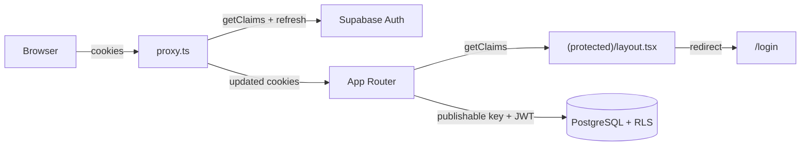

# BeFluencer Reports — Authentication

Internal cookie-based authentication for a single-agency application. Public signup is disabled; users are created manually in the Supabase Dashboard.

## User model

| Aspect | Detail |
|--------|--------|
| Audience | Agency owner and manually invited staff only |
| Signup | Disabled in Supabase Auth — no signup page in the app |
| Provisioning | Create users in Supabase Dashboard → Authentication → Users |
| Roles | All signed-in users share full internal access (single agency) |

There is no multi-tenant or per-user row ownership in v1. RLS grants authenticated users access to all application rows.

## Architecture



## Cookie-based SSR authentication

Sessions are stored in HTTP cookies managed by `@supabase/ssr`:

| Module | Purpose |
|--------|---------|
| `lib/supabase/client.ts` | Browser client for interactive auth |
| `lib/supabase/server.ts` | Server client with Next.js `cookies()` |
| `lib/supabase/proxy.ts` | Token refresh logic |
| `proxy.ts` | Next.js 16 proxy entry — runs on matched routes |
| `lib/supabase/auth.ts` | `getVerifiedAuth()` helper using `getClaims()` |

## Token refresh (`proxy.ts`)

Server Components cannot write cookies. The root `proxy.ts` delegates to `lib/supabase/proxy.ts`, which:

1. Creates a Supabase server client bound to the incoming request cookies.
2. Calls `supabase.auth.getClaims()` to refresh expired tokens when needed.
3. Writes refreshed tokens to both the request (for downstream Server Components) and response (for the browser).

Static assets, images, favicon, and Next.js internals are excluded via the proxy `matcher`.

## Authorization

**Always use `getClaims()` or `getUser()` for authorization. Never use `getSession()`.**

| API | Safe for authorization? | Notes |
|-----|-------------------------|-------|
| `getSession()` | No | Reads cookie/storage without re-verifying the JWT |
| `getClaims()` | Yes | Verifies JWT signature; refreshes token when near expiry |
| `getUser()` | Yes | Validates with Auth server (network round trip) |

Protected routes use `getVerifiedAuth()` in `app/(protected)/layout.tsx`. Unauthenticated visitors are redirected to `/login`.

The login page uses the same check to redirect already-signed-in users to `/`.

## Routes

| Route | Access | Notes |
|-------|--------|-------|
| `/` | Protected | Campaign report (mock data for now) |
| `/campaigns`, `/reports`, `/settings` | Protected | Internal stubs |
| `/login` | Public | Email/password sign-in via Server Action |
| `POST /auth/signout` | Public | Signs out and redirects to `/login` |

No logout control is exposed in the report UI yet. Sign out is available via `POST /auth/signout` for future navigation.

## Login flow

1. User submits email and password on `/login`.
2. Server Action validates input with Zod (Turkish error messages).
3. `supabase.auth.signInWithPassword()` establishes a session.
4. On success, redirect to `/`.
5. Proxy refreshes cookies on subsequent requests.

## Row Level Security

Database policies are defined in `supabase/migrations/20260805210000_internal_auth_policies.sql`:

- All table privileges revoked from `anon`.
- `SELECT`, `INSERT`, `UPDATE`, `DELETE` granted to `authenticated`.
- RLS enabled on every table.
- Four explicit policies per table (select, insert, update, delete) for `authenticated` only.
- No anonymous policies.

The app uses only the publishable key. The JWT from the signed-in session satisfies RLS as role `authenticated`.

## Environment variables

Only public keys are used — no secret or service-role key:

```
NEXT_PUBLIC_SUPABASE_URL=
NEXT_PUBLIC_SUPABASE_PUBLISHABLE_KEY=
```

Validated in `lib/env.ts`. Environment values are never logged.

## Public report sharing

Public read-only links do **not** reuse internal authenticated policies. Anon
has no `SELECT` on `public_report_shares`. Access goes through security-definer
RPCs (`resolve_public_report_share`, `consume_public_report_share`,
`consume_public_report_pdf_share`) that return a single immutable snapshot.
Routes live outside `(protected)` at `/r/[token]` and `/api/public/*`.
See [public-report-sharing.md](./public-report-sharing.md).

## Local setup checklist

1. Disable public signup in Supabase Dashboard → Authentication → Providers → Email.
2. Apply migrations (initial schema, then internal auth policies).
3. Create at least one user in Supabase Dashboard → Authentication → Users.
4. Ensure `.env.local` contains the public Supabase URL and publishable key.
5. Run `npm run dev` and sign in at `/login`.
