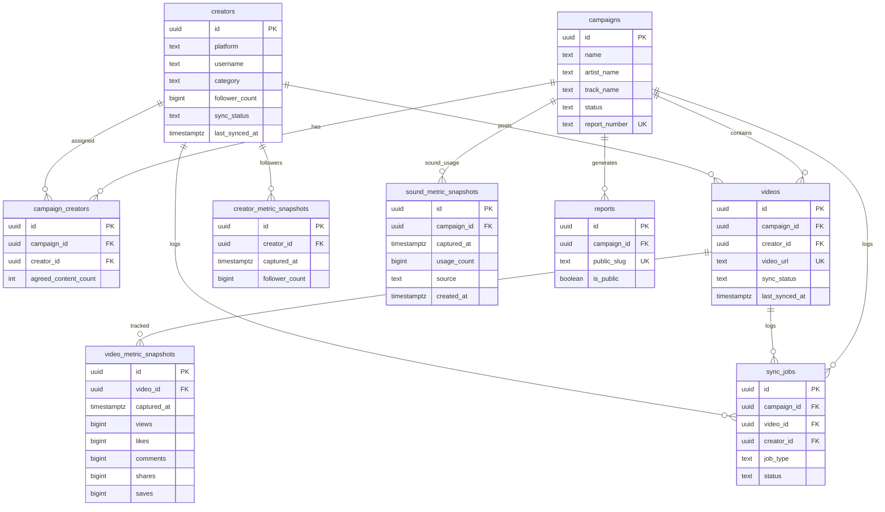
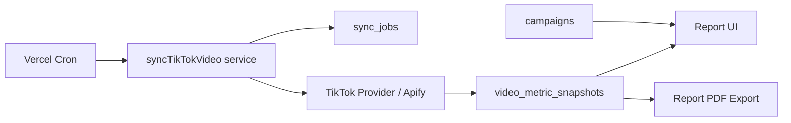

# BeFluencer Reports — Database

Internal PostgreSQL schema hosted on Supabase for TikTok music campaign analytics.

## Overview

The database stores campaigns, creators, tracked videos, time-series metrics, generated reports, and sync job audit logs. Metrics are captured as **snapshots** so reports can show growth over time and historical comparisons.

## Entity relationships



## Tables

### `campaigns`

Primary campaign record for a music promotion. Contains artist/track metadata, client name, sound URL (`sound_url` — reused as the TikTok music sync input), lifecycle status, reporting dates, and a unique `report_number` used in PDF exports.

Sound sync metadata (Phase 11): `tiktok_sound_id`, `tiktok_sound_title`, `tiktok_sound_author`, `sound_last_synced_at`, `sound_sync_status` (`pending` / `success` / `failed`), `sound_sync_error`.

### `creators`

Global creator directory keyed by `(platform, username)`. Stores avatar, follower count, nullable category (`nano` / `micro` / `macro` / `mega` / legacy `template`), `category_source` (`auto` | `manual`), and profile sync metadata (`last_synced_at`, `sync_status` — same vocabulary as videos: `pending` / `success` / `failed`).

`follower_count` is the *current* value and is overwritten on a successful profile sync. Historical values live in `creator_metric_snapshots`.

### `campaign_creators`

Many-to-many link between campaigns and creators with deliverable count, optional fee, and notes. Provider sync never touches these campaign-specific fields.

### `creator_metric_snapshots`

Append-only follower / profile statistics history per creator. Columns: `follower_count` (required), optional `following_count`, `total_likes`, `video_count`. Unique `(creator_id, captured_at)`.

RLS grants SELECT / INSERT / DELETE to authenticated users and deliberately withholds UPDATE so historical follower counts cannot be rewritten. Correcting a bad row means deleting it.

Multi-creator reads go through `creator_growth_bounds(p_creator_ids uuid[])` (`20260904190000_creator_growth_bounds.sql`), which returns the earliest and latest snapshot per creator — one row each. It is `security invoker`, so the table policy above still applies, and `execute` is granted to `authenticated` only. Selecting the full series for many creators at once is capped by PostgREST's default row limit and silently returns only the oldest rows, so growth must not be computed that way.

See [creator-profile-sync.md](./creator-profile-sync.md).

### `videos`

Individual tracked posts for a campaign. Holds platform URL, thumbnail, caption, publish date, and sync metadata (`last_synced_at`, `sync_status`). Latest metrics are **not** stored here.

### `video_metric_snapshots`

Append-only metric history per video. Each sync inserts a new row with views, likes, comments, shares, and saves at `captured_at`.

### `sound_metric_snapshots`

Append-only TikTok sound usage counts per campaign for the “Ses Kullanım Büyümesi” chart. Columns include `usage_count`, `source` (`manual` | `apify`, default `manual`), and `created_at`. Unique `(campaign_id, captured_at)`.

RLS grants SELECT / INSERT / DELETE to authenticated users and withholds UPDATE (same append-only model as creator snapshots). Both manual and Apify rows feed live and generated reports. See [tiktok-sound-sync.md](./tiktok-sound-sync.md).

### `reports`

Generated report metadata including optional public share slug and visibility flag.

### `sync_jobs`

Audit trail for TikTok sync runs.

| Column | Notes |
|--------|-------|
| `job_type` | `tiktok_video_sync`, `tiktok_creator_sync`, or `tiktok_sound_sync` (no DB check) |
| `campaign_id` / `video_id` | Targets for video / sound sync (`campaign_id` for sound) |

### `scheduled_sync_runs`

Parent audit log for cron / manual full TikTok sync orchestrator runs (`full_tiktok_sync`). Authenticated clients have SELECT only; writes use the server-only service-role client. See [scheduled-sync.md](./scheduled-sync.md).

Advisory lock RPCs: `try_acquire_scheduled_sync_lock()`, `release_scheduled_sync_lock()`.
| `creator_id` | Target for creator sync (`campaign_id` stays null — a creator is global) |
| `status` | `running`, `success`, `failed` |
| `error_message` | Sanitized Turkish message — no provider secrets |
| `started_at` / `completed_at` | Job lifecycle timestamps |

One row per sync attempt. Campaign bulk video sync creates one job per video; campaign bulk creator sync creates one job per unique TikTok creator.

### `leads`

Inbound marketing-site form submissions (`brand_inquiry`, `creator_application`). Identity columns (`full_name`, `email`, `phone`) are extracted for listing and search; `payload` keeps the raw submitted fields minus consent and honeypot. `creator_id` is set only when an admin explicitly converts a creator application.

RLS: `leads_authenticated_all`; `anon` has no table privilege. The marketing site writes through `create_marketing_lead(p_kind, p_full_name, p_email, p_phone, p_payload, p_submitted_at)` — security definer, `execute` granted to `anon` — called by `POST /api/public/leads` after it validates a shared secret (`LEADS_INGEST_SECRET`).

Migration: `20260904200000_marketing_leads.sql`. See [leads.md](./leads.md).

## TikTok automatic sync (Phase 5)

Manual sync actions call `features/sync/services/sync-tiktok-video.ts`, which uses the `TikTokMetricsProvider` adapter (Apify implementation).

| Flow | Trigger | Service |
|------|---------|---------|
| Single video | Video detail — “TikTok Verisini Güncelle” | `syncTikTokVideo` |
| Campaign bulk | Campaign videos — “Tüm TikTok Videolarını Güncelle” | `syncCampaignTikTokVideos` |

**Snapshot append rules (automatic):** Insert a new `video_metric_snapshots` row only when there is no prior snapshot, metrics changed, or the latest snapshot is older than 6 hours. Same table and unique index as manual entry.

**Creator updates (video sync only):** Provider may fill missing `display_name`, `avatar_url`, or `follower_count` only — never overwrite manually maintained values. Dedicated creator profile sync is separate (below).

**Failure handling:** On sync failure, `videos.sync_status = failed` and the job stores a sanitized error. Last successful snapshot is preserved.

See [tiktok-sync.md](./tiktok-sync.md) for architecture and configuration.

## Creator profile sync (Phase 10 / 12)

Migration: `20260805250000_creator_profile_snapshots.sql`

| Flow | Trigger | Service |
|------|---------|---------|
| Single creator | Creator detail / list / campaign row — “TikTok Profilini Güncelle” | `syncTikTokCreator` |
| Campaign bulk | Campaign creators — “Tüm TikTok Profillerini Güncelle” | `syncCampaignTikTokCreators` |

**Snapshot append rules:** Insert a new `creator_metric_snapshots` row when there is no prior snapshot, follower or optional metrics changed, or the latest snapshot is older than 24 hours.

**Creator updates:** Successful sync overwrites `follower_count` and `profile_url`, and writes `display_name` / `avatar_url` only when the provider returned a non-empty value. Recalculates `category` only when `category_source = auto`. Never touches `campaign_creators` fields.

**Failure handling:** `creators.sync_status = failed`; previous successful profile data and all snapshots are preserved.

See [creator-profile-sync.md](./creator-profile-sync.md).

## Live campaign report (Phase 6)

Authenticated route: `/campaigns/[id]/report`

| Source | Usage |
|--------|-------|
| `campaigns` | Header metadata, report number fallback |
| `reports` | Optional report record (explicit create only) |
| `videos` (non-unavailable) | Content gallery, featured selection |
| `video_metric_snapshots` | KPI totals, timeline, engagement |
| `sound_metric_snapshots` | Sound growth chart |
| `creators` (via videos) | Leaderboard, contribution, avatar stack |

Aggregation rules: [live-report.md](./live-report.md)

## Versioned report snapshots (Phase 7)

Table: `report_versions`

| Column | Notes |
|--------|-------|
| `report_id` | Parent report series (`reports.id`) |
| `version_number` | Incrementing per series, unique with `report_id` |
| `status` | `generating`, `ready`, `failed`, `archived` |
| `snapshot` | Immutable JSONB for historical rendering |
| `content_hash` | SHA-256 for duplicate detection |

One report series per campaign (`reports.campaign_id` unique).

Historical report pages read **only** `report_versions.snapshot`.

See [report-generation.md](./report-generation.md).

## PDF export tokens (Phase 8)

Table: `report_export_tokens`

| Column | Notes |
|--------|-------|
| `report_version_id` | Version this token may render (`on delete cascade`) |
| `token_hash` | SHA-256 hex of the raw token; the raw value is never stored |
| `created_by` | Requesting user (`auth.users.id`) |
| `expires_at` | Constrained to at most `created_at + 5 minutes` |
| `used_at` | Set on consumption; single-use |

`authenticated` holds `select` and `insert` only, both scoped to
`created_by = auth.uid()`. There is no `update` grant, so a client cannot reset
`used_at`.

`consume_report_export_token(text)` is a `security definer` function that
atomically claims an unexpired, unused token and returns the snapshot for that
version when its status is `ready` or `archived`. `anon` may execute that single
function and has no privileges on the table — this is how the headless browser
loads the print route without a session and without a service-role key.

`purge_expired_report_export_tokens()` removes tokens that expired over a day ago.

PDF export is read-only against `report_versions`, so snapshot immutability holds.

See [pdf-export.md](./pdf-export.md).

## Manual metric entry (Phase 4)

Internal users record snapshots manually through Server Actions in `features/metrics/`.

| Flow | Route | Action |
|------|-------|--------|
| Video metrics | `/campaigns/[id]/videos/[videoId]/metrics/new` | `createVideoMetricSnapshot` |
| Sound usage | `/campaigns/[id]/sound-metrics/new` | `createSoundMetricSnapshot` |

**Latest snapshot semantics:** For each active video, the row with the most recent `captured_at` is treated as “latest”. Campaign totals sum latest snapshots across videos (excluding `unavailable` / removed videos).

**Append-only:** Snapshots are never updated in place. Deletes are explicit via management UI only.

**Duplicate protection:** Unique indexes on `(video_id, captured_at)` and `(campaign_id, captured_at)` — see `20260805220000_metric_snapshot_integrity.sql`.

**Engagement warning:** If likes + comments + shares + saves exceed views, the UI warns but still allows save.

**Sound growth:**

```
growth_multiplier = latest.usage_count / initial.usage_count   (initial > 0)
growth_absolute   = latest.usage_count - initial.usage_count
```

Future scheduled cron will insert into the same tables using the same append-only rules. See [tiktok-sync.md](./tiktok-sync.md).

## Metric snapshot strategy

1. A scheduled job selects stale videos (`last_synced_at` older than the configured interval).
2. TikTok data is fetched through a provider adapter (future step).
3. A new row is inserted into `video_metric_snapshots` — existing rows are never updated.
4. `videos.last_synced_at` and `videos.sync_status` are updated on the parent record.
5. Campaign charts aggregate snapshots by date range (sum, latest, or delta between two captures).

Sound usage follows the same append-only pattern in `sound_metric_snapshots`.

## Engagement rate formula

For a video at snapshot time:

```
engagement_rate = (likes + comments + shares + saves) / views × 100
```

For campaign-level averages, use the latest snapshot per video within the selected date range, then aggregate:

```
campaign_engagement_rate = sum(likes + comments + shares + saves) / sum(views) × 100
```

Store raw counts in snapshots; compute rates in application code so formulas remain transparent and auditable.

## Why snapshots instead of overwriting metrics

- **Trend charts** require historical values (performance trend, sound growth, week-over-week deltas).
- **Report integrity** — a PDF generated on March 1 should reflect metrics as they were captured then, not today’s numbers.
- **Sync debugging** — failed or partial syncs are visible in `sync_jobs` without losing prior good data.
- **Auditability** — agency owners can explain how a number changed over time.

Overwriting a single `views` column on `videos` would make growth analytics and historical reports impossible.

## Row Level Security (RLS)

RLS is **enabled on every table, without exception**. That is the one rule with no
variation — `alter table … enable row level security` appears for every table in
every migration that creates one.

Beyond that, there is **no single policy shape**. Public signup is disabled and
users are created manually in the Supabase Dashboard, so the models below differ
by what the data is, not by who is signed in.

### Model A — shared operational data (most tables)

Campaigns, creators, videos, metric snapshots, reports, sync logs. Every
authenticated user may read and write **all rows**; there is no per-user scoping.

Two spellings of this model exist, and both are live:

| Period | Shape | Naming |
|--------|-------|--------|
| Migrations before `20260814090000` | Four policies per table, one per operation | `{table}_authenticated_select` / `_insert` / `_update` / `_delete` |
| `20260814090000` onward | A single combined policy | `{table}_authenticated_all`, or `{table}_admin_all` for portal/admin tables |

```sql
create policy sound_reports_authenticated_all on public.sound_reports
  for all to authenticated using (true) with check (true);
```

The older four-policy tables were **not** rewritten, so both forms remain correct
in the schema. **New tables should use the single `for all` policy** — do not copy
the four-policy split out of an early migration.

### Model B — owner-scoped personal data

`personal_finance_entries`, `personal_finance_recurring`, `personal_finance_settings`.
Rows belong to one user, so policies scope on `auth.uid()` rather than `using (true)`:

```sql
create policy personal_finance_entries_owner_select on public.personal_finance_entries
  for select to authenticated using (user_id = auth.uid());
```

These deliberately keep the per-operation split, because the `USING` and
`WITH CHECK` expressions differ between read and write. Note also that
`personal_finance_settings` is granted `select, insert, update` only — withholding
`delete` at the grant level is intentional.

Use this model for any new table holding data that belongs to one user.

### Model C — public / anonymous access

`anon` never receives privileges on an application table. Public surfaces
(`/r/<token>`, `/lists/<token>`, the client and creator portals) read exclusively
through `security definer` functions:

```sql
revoke all on function public.resolve_client_portal(text) from public;
grant execute on function public.resolve_client_portal(text) to anon, authenticated;
```

The single exception is `storage.objects`, where public read policies do exist for
the creator-avatar and featured-video-preview buckets
(`creator_avatars_public_select`, `featured_video_previews_public_select`) so that
`` and `<video>` sources resolve without a session.

### On `revoke … from anon`

Migration `20260805210000_internal_auth_policies.sql` revokes `anon` privileges as
a baseline, and most later migrations repeat a `revoke … from anon` line for the
tables they add as defence in depth. This repetition is **not universal** — for
example `20260828120000_sound_content_reports.sql` grants to `authenticated`
without an explicit anon revoke.

So: do not assume every table carries its own revoke line. What actually protects a
table is RLS being enabled plus the absence of any `anon` grant or policy. Adding
an explicit revoke for new tables is still preferred.

### Checklist for a new table

1. `enable row level security` — always
2. Grant `authenticated` only the operations the feature genuinely needs
3. Pick Model A (shared) or Model B (owner-scoped) and name the policy accordingly
4. Never grant `anon`; if public access is required, add a `security definer` RPC
5. For append-only tables, withhold `UPDATE` deliberately — see the snapshot tables above

Baseline migration: `supabase/migrations/20260805210000_internal_auth_policies.sql`.
Current reference examples: `20260828120000_sound_content_reports.sql` (Model A),
`20260815090000_personal_finance.sql` (Model B),
`20260817090000_client_portal_v1.sql` (Model C).

Public report sharing uses a **separate controlled mechanism** — `public_report_shares`
plus security-definer RPCs — not broad anon table policies. See
[public-report-sharing.md](./public-report-sharing.md) and `docs/auth.md`.

Scheduled sync uses a **server-only** service-role client (`lib/supabase/admin.ts`).
It is never imported in browser code.

## Environment variables

### Client-safe (browser + server)

| Variable | Purpose |
|----------|---------|
| `NEXT_PUBLIC_SUPABASE_URL` | Supabase project URL |
| `NEXT_PUBLIC_SUPABASE_PUBLISHABLE_KEY` | Publishable (anon) key for browser and server clients |

Validated in `lib/env.ts` with Zod.

### Server-only (TikTok sync)

| Variable | Purpose |
|----------|---------|
| `APIFY_API_TOKEN` | Apify API token — never exposed to client |
| `APIFY_TIKTOK_ACTOR_ID` | TikTok scraper actor ID (video; also used for creator profiles by default) |
| `APIFY_TIKTOK_CREATOR_ACTOR_ID` | Optional dedicated creator-profile actor |

Validated in `lib/env.server.ts` (uses `server-only` package). Required only when sync is invoked.

### Server-only (PDF export + public share URLs)

| Variable | Required | Purpose |
|----------|----------|---------|
| `APP_URL` | when export or share creation is invoked | Internal app origin (PDF print navigation) |
| `PUBLIC_REPORT_URL` | no (falls back to `APP_URL`) | Public share absolute origin for `/r/<token>` |
| `MARKETING_SITE_URL` | no | Future corporate site origin |
| `CHROME_EXECUTABLE_PATH` | no | Explicit Chrome binary when auto-detection fails |

Validated in `lib/origins` / `lib/env.server.ts`. Origins are never read from a
request header. See [platform-architecture.md](./platform-architecture.md),
[pdf-export.md](./pdf-export.md) and [public-report-sharing.md](./public-report-sharing.md).

### Migration: public_report_shares

`supabase/migrations/20260805280000_public_report_shares.sql`

| Object | Purpose |
|--------|---------|
| `public_report_shares` | Revocable shares; stores SHA-256 only |
| `public_report_share_access_events` | Idempotent page-access nonces |
| `resolve_public_report_share` | SSR load without increment |
| `consume_public_report_share` | Beacon increment (nonce) |
| `consume_public_report_pdf_share` | PDF path increment + PDF gate |
| `issue_public_report_print_token` | One-time `report_export_tokens` for public PDF |

## Supabase clients

| Module | Usage |
|--------|-------|
| `lib/supabase/client.ts` | Browser client via `createBrowserClient` |
| `lib/supabase/server.ts` | Server client via `createServerClient` + Next.js cookies |
| `lib/supabase/verify-connection.ts` | Server-only connectivity check via `getClaims()` (not authorization) |
| `lib/supabase/auth.ts` | `getVerifiedAuth()` — JWT verification for route protection |
| `lib/supabase/proxy.ts` | Cookie refresh logic used by root `proxy.ts` |

## Future automation flow



1. Campaign and videos are created in Supabase (replacing mock data).
2. Cron triggers metric sync for active campaigns.
3. Snapshots accumulate over the campaign lifetime.
4. Report UI reads aggregated snapshot data.
5. PDF export stores metadata in `reports`.

## Migrations

| Migration | Purpose |
|-----------|---------|
| `supabase/migrations/20260805200000_initial_schema.sql` | Tables, indexes, RLS enabled |
| `supabase/migrations/20260805210000_internal_auth_policies.sql` | Revoke anon, grant authenticated, RLS policies |
| `supabase/migrations/20260805220000_metric_snapshot_integrity.sql` | Unique snapshot timestamps per video/campaign |
| `supabase/migrations/20260805230000_versioned_report_snapshots.sql` | Report versions + immutability trigger |
| `supabase/migrations/20260805240000_report_pdf_exports.sql` | Single-use PDF export tokens + consumption function |

Apply via Supabase Dashboard SQL editor (run each file in order), or locally:

```bash
supabase db push
```

Do not push migrations to remote unless you intend to apply schema changes to that project.

Authentication details: `docs/auth.md`.
